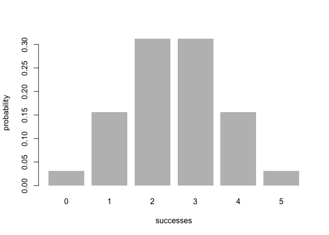

<!-- README.md is generated from README.Rmd. Please edit that file -->
Overview
--------

`"binomial"` is a self-created package for calculating the binomial distribution given the number and probability of success in a fixed number of random trials performed, and to visualize such probability distribution.

-   `bin_choose()` calculates the number of combinations
-   `bin_probability()` calculates the probability of getting successes
-   `bin_distribution()` creates an object of class `bindis`cand compute the probability distribution
-   `bin_cumulative()` creates an object of class `bincum` and compute the cumulative probability distribution
-   `bin_variable()` creates an object of class `binvar` and create binomial variable using given number of trials and successes
-   `plot.bindis()`graphs a barplot to display the probability histogram of a binomial distribution object `bindis`
-   `plot.bincum()` graphs the cumulative distribution of an object "bincum"
-   `summary.binvar()`gives the full summary description of the object

Helpful functions to calculate summary measures
-----------------------------------------------

-   `bin_mean()` to calculate the mean.
-   `bin_variance()` to calculate the variance.
-   `bin_mode()` to calculate the most likely success number.
-   `bin_skewness()` to measure the skewenss.
-   `bin_kurtosis()` to calculate the kurtosis.

Motivation
----------

This package has been developed to help people understand and easily calculate binomial related things.

Usage
-----

``` r
library(binomial)

# get the total combination number
bin_choose(n = 5, k = 2)
#> [1] 10

# get the binomial probability
bin_probability(success = 2, trials = 5, prob = 0.5)
#> [1] 0.3125

# create the binomial distribution
dis1 <- bin_distribution(trials = 5, prob = 0.5)
dis1
#>   success probability
#> 1       0     0.03125
#> 2       1     0.15625
#> 3       2     0.31250
#> 4       3     0.31250
#> 5       4     0.15625
#> 6       5     0.03125

# get the barplot of the probability histogram of a binomial distribution
plot.bindis(dis1)
```



``` r

# create the cumulative distribution
dis2 <- bin_cumulative(trials = 5, prob = 0.5)
#> 
#> Attaching package: 'dplyr'
#> The following objects are masked from 'package:stats':
#> 
#>     filter, lag
#> The following objects are masked from 'package:base':
#> 
#>     intersect, setdiff, setequal, union
dis2
#>   success probability cumulative
#> 1       0     0.03125    0.03125
#> 2       1     0.15625    0.18750
#> 3       2     0.31250    0.50000
#> 4       3     0.31250    0.81250
#> 5       4     0.15625    0.96875
#> 6       5     0.03125    1.00000

# get the line plot of cumulative probability distribution 
plot.bincum(dis2)
```


``` r


# get the binomial variables 
bin1 <- bin_variable(trials = 10, p = 0.3)
bin1
#> "Binomial variable"
#> 
#>  Parameters
#>  - number of trials: 10
#>  - prob of success : 0.3

# get the summary the binomial statistical elements
summary.binvar(bin1)
#> "Binomial variable"
#> 
#>  Parameters
#>  - number of trials: 10
#>  - prob of success : 0.3
#> 
#>  Measures
#>  - mean    : 3
#>  - variance: 2.1
#>  - mode    : 3
#>  - skewness: 0.2760262
#>  - kurtosis: -0.1238095
```
